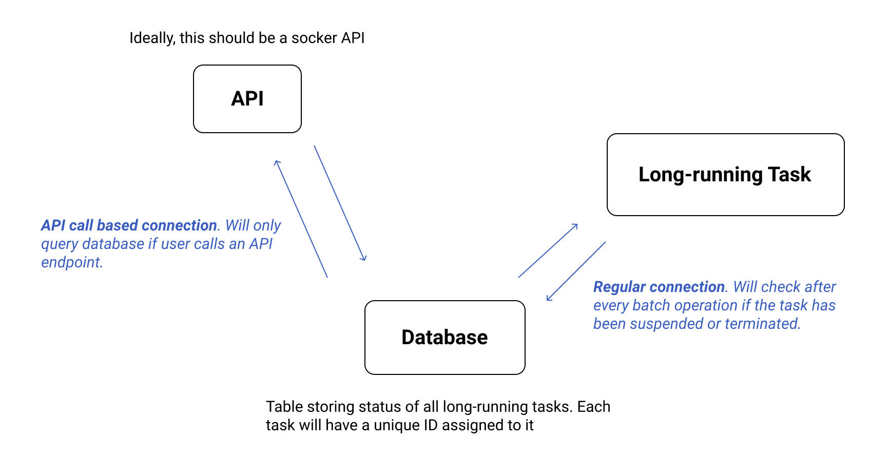

# long-running-task-controller
Control long running backend tasks in real-time without breaking any business logic.

## Problem Statement
There are a lot of long-running tasks on a server, and usually once you trigger such tasks its really difficult to tap into them and suspend/resume/terminate the tasks, upon realizing that an erroneous request went through from one of the users.

There should be a feature to control such long running tasks in real-time. This will ensure that resources like compute/memory/storage/time are used efficiently at our end.

## Proposed Solution
The solution to this problem is to process requests in batches rather than doing it all once, because even though we might be able to terminate an un-batched request by killing the process, the process itself won't be able to perform the cleanup operation and therefore might leave few resources open. There can be some other side-effects as well to this approach, like breaking the business logic.

The actual implementation of this solution might differ but the concept remains the same, break the task implementation into batches of requests. For example, there can be two possible implementations of this solution:

### The Object Orientation Approach
The idea is to wrap the actual task implementation around a class which handles all the task management. This outer class will know when a user wants to suspend/terminate/resume a particular task and the respective task manager class can handle all of these cases according to its convinience. This will give the task manager time to clean up all the open resources and suspend/terminate/resume a particular task without breaking any business logic.

### The Message Queue Approach
Issue with the above implementation is that if a user suspends a particular task, that task will still hold up a lot of server resources (because basically the task just went on a sleep mode). Therefore if we have a lot of suspened tasks, that might lead to other problems.

A better solution would be to use a message queue, e.g. Redis or RabbitMQ, etc, and stream these batches of requests to an external service/method via the message queue. Each task will have its own queue so that it is not affectted by any other task. In this case, if a user suspends a particular task then the respective task manager will stop popping items from the queue until the user resumes that particular task. This might hold up other tasks of the same kind, but is still better than the 1st approach.

## Solution Design Architecture
For the sake of implementation, I've implemented the 1st approach using a database (to interact with the user facing API and the actual task), because there isn't much difference between the 1st and 2nd approach in terms of logic.

Here's a diagram to explain this implementation:

## Implementation
There's a table in the database, which stores the state of all the tasks on server. Each task is assigned a unique Id using which a user can control the state of a particular task. Additionally, there are two more properties being stored in the database:

### Desired State
This is the state which the user wants a task to be in. For example, a task might be in running state and the user wants to suspend this task, then they will have to set this parameter accordingly.

### Current State
This is the state in which the task currently is. If a user sets the desired state differently then the respective task will automatically change its state, though it might take some time for it to do so.

_Note: Once a task is terminated, users won't able able to change its state anymore._

There are 4 different types of states:
- `INIT` : Task has been created and is currently being initialized
- `RUN` : Task has been initialized and is currently running
- `SUSPEND` : Task has been suspended by the user
- `TERMINATE` : Task has been terminated by the user
